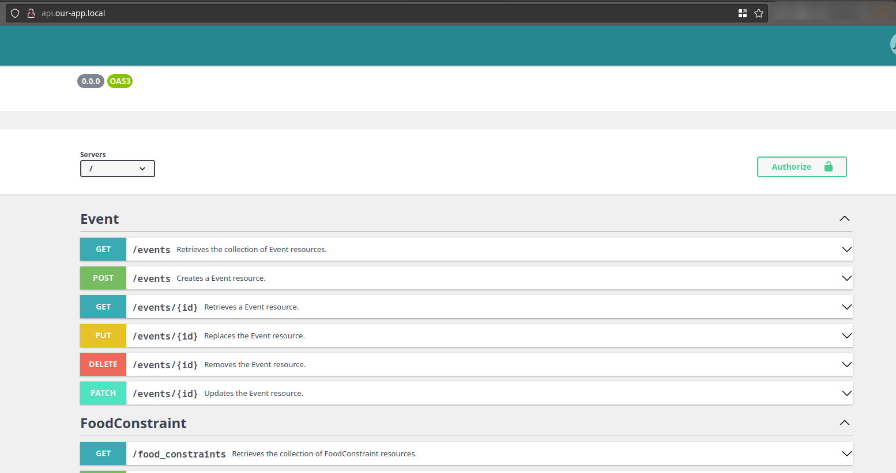

# PRO_2022

<!-- TODO: A table of contents? -->
## Dev - Starting the project

### Initial setup
Install [virtualbox](https://www.virtualbox.org/wiki/Downloads) with the extension pack

Install [vagrant](https://www.vagrantup.com/downloads)

There is a bit of setup to do the first time you want to run the app.
1. Edit the hosts file of your system (windows `C:\Windows\System32\Drivers\etc\hosts`, linux you should know it ;))
1. Add the following content
   ```
   192.168.56.69   api.our-app.local
   192.168.56.69   our-app.local
   ```

### Start the project
To start the project, simply open a terminal to the `app` directory and run `vagrant up`

Then you can use `vagrant ssh` to ssh into the VM. You have now entered the development environment

#### backend
In order to have a working backend a number of things must be initialized, go into the `app/backend` directory (from within th VM) and run `composer setup`


To run symfony unit tests in the backend directory and run the following command `composer test`

### Access
- The backend can be accessed from `api.our-app.local`. 
- The frontend can be accessed from `our-app.local`
- MailHog can be access from `our-app.local:8025`


### API

The whole API available is auto-documented by the [API Platform](https://api-platform.com/) framework and available on the backend url:




### Technologies

We use famous frameworks and tools for this project which handle in a standard way the libraries and configurations.
Any information can be found in their respective configuration file and documentations.

#### Continuous Integration

We use [github-worklfow](https://docs.github.com/en/actions/using-workflows).  

#### Backend

* Main Framework: [Symfony](https://symfony.com/)
* Package Manager: [Composer](https://getcomposer.org/)
* Test Framework: [phpunit](https://phpunit.de/)
* Linter: [CS-fixer](https://github.com/FriendsOfPHP/PHP-CS-Fixer) with [PSR12](https://www.php-fig.org/psr/psr-12/) Standard

#### Frontend

* Main Framework: [Angular](https://angular.io/) 
* Package Manager: [npm](https://www.npmjs.com/)
* Test Framework:  [Karma](https://karma-runner.github.io/latest/index.html) / [Jasmin](https://jasmine.github.io/)
* Linter:  [ESLint](https://eslint.org/) (the configuration file is `app/frontend/.eslintrc.json`)


### Side note
The URL might change once we have settled for a name. In that case, simply change the entries in the hosts file and access the different parts using the new URLs.
