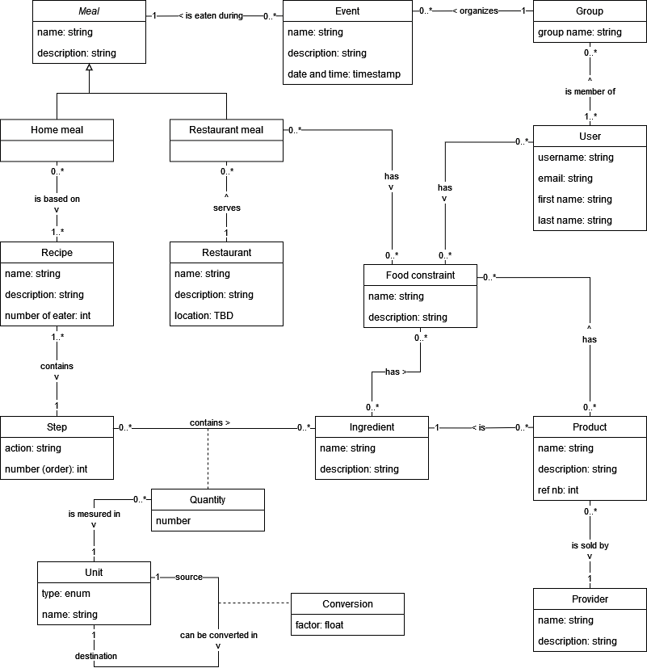

# Entity-association model

After an analysis of the data requirements of our application, the following entity-association model was designed:

Remarks:

1. The type of a restaurant location is yet to be determined. Some possible choices are:
   - GPS coordinates
   - A simple string of characters
   - Multi-valued attribute: address (street name, street number, city, zip code, country)
2. It is only possible to convert a unit into another unit if they are of the same type. The possible types are:
   - Mass (gram, ounce, etc.)
   - Volume (milliliter, fluid ounce, cup, tablespoon, etc.)
   - Length (meter, inch, etc.)
   - Temperature (Celsius, Fahrenheit)
   - Time (minute, hour, etc.)
   - Unitless (one, half, a dozen, etc.)