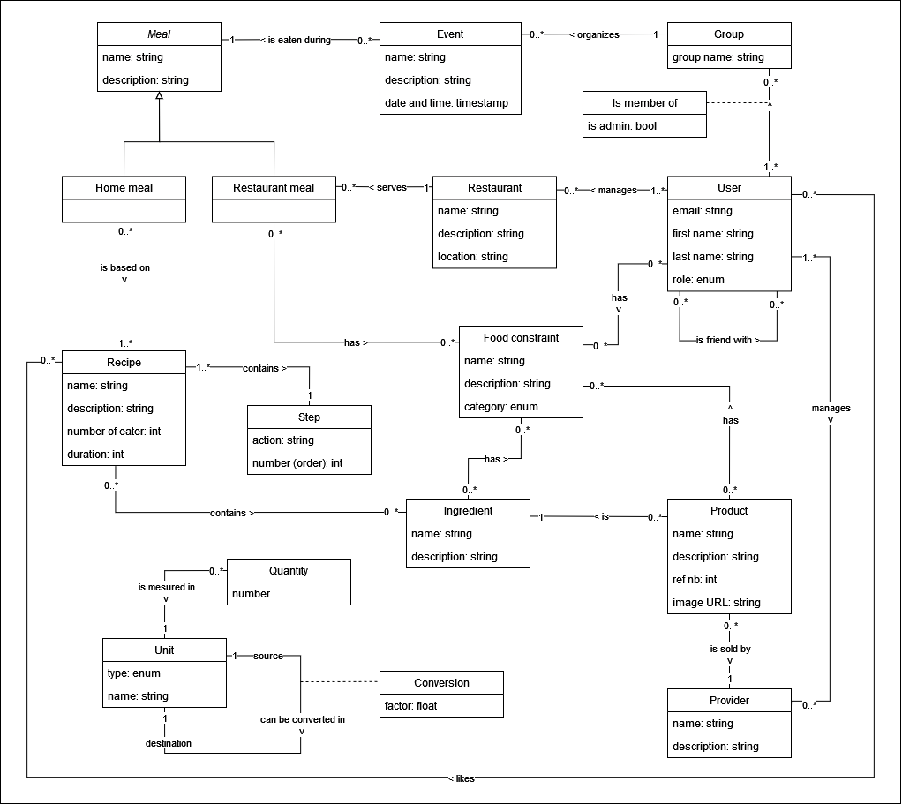

# Entity-association model

[TOC]

## Diagram of the model

After an analysis of the data requirements of our application, the following entity-association model was designed:

## Description of the entities

### Food constraints

A food constraint is a constraint that forbids, for various reasons and with various levels of consequences if not respected, the inclusion of something in a meal. Food constraints come in different forms. At first, we will restrict those to 2 main categories:

- Food intolerances and allergies (celiac disease, nut allergies, lactose intolerance, etc.)
- Ethical choices (vegetarian, vegan, no seafood, etc.)

Food constraints are linked to the following entities:

- User: A user can specify food constraints that he/she might have
- Restaurant meal: A meal served by a restaurant can be incompatible with certain food constraints
- Product and Ingredient: Specific ingredients and/or products can also be incompatible with certain food constraints.
  Note: The difference between these two entities will be explained later in this document

Each of these links will be mentioned and, if need be, further clarified in the corresponding linked entity.

### Events, groups and users

#### Users

In the application, a user will be able to:

- specify certain food constraints in his/her user profile;
- add other users to a group or join a group to partake in a group meal;
- search for meals.

Note: This last feature does not require a link between the user and the meal in this model.

#### Events

An event, or group meal, links a group of users to a specific meal that will take place. It is through events that group meals can be planned according to the group collective food constraints.

#### Group

A group is simply one or more users that plan to eat one or more meals together.

### Meals

A meal can either be a home-cooked meal or it can be restaurant meal. As stated above, it can be linked to an event in case of a group meal. In both cases, meals are indirectly linked to food constraints.

#### Home-cooked meals

Home cooked-meals are based on one or more recipes that specifies how to prepare it. Once a meal is chosen, the user will be able to pick a specific recipe to cook it. Depending on the chosen recipe, a meal can be linked to different food constraints.

#### Restaurant meals

A restaurant meal is served by a specific restaurant, who cooks it. The food constraints associated with it are advertised by the restaurant, who is legally responsible for the accuracy of the information it provides.

### Restaurants

Restaurants are responsible for the potential food constraints that the meals they cook can entail.

The type of a restaurant location is yet to be determined. Some possible choices are:

- GPS coordinates
- A simple string of characters
- Multi-valued attribute: address (street name, street number, city, zip code, country)

### Recipes, steps and ingredients

A recipe is an ordered sequence of steps that result in a meal for a specified amount of people. Each step can involve ingredients. In the context of a recipe, an ingredient is a precursor that cannot be further subdivided. It should be noted that different recipes will not necessarily consider the same things to be ingredients.

Example: Let's suppose that a user wants to eat pasta with tomato sauce. On the one hand, a particular recipe can list "tomato sauce" as one of the ingredient and the user is assumed to have it ready as basic ingredient before beginning the recipe. On the other hand, another recipe can list "tomatoes", "salt", "garlic" and "basil" as ingredients and extra steps to make the tomato sauce as part of the recipe itself.

#### Quantities, units and conversions

If a step requires ingredients, the quantity of each ingredient is specified in the appropriate unit.

It is only possible to convert a unit into another unit if they are of the same type. The possible types are:

- Mass (gram, ounce, etc.)
- Volume (milliliter, fluid ounce, cup, tablespoon, etc.)
- Length (meter, inch, etc.)
- Temperature (Celsius, Fahrenheit)
- Time (minute, hour, etc.)
- Unit-less quantity (one, half, a dozen, etc.)

### Products and providers

A product is an ingredient that is sold by a provider. Multiple products can be the same ingredient, but it does not mean they are strictly equivalent.

An ingredient represents the abstract concept of a recipe's precursor and as such can intrinsically be linked to some food constraints. Conversely, a product is a real-world physical thing that is an ingredient. It inherits all of the food constraints of the ingredient it is, but can have additional food constraints depending on how it is made by the provider.

Providers are responsible for the accuracy of the food constraints linked to their respective products.

Example: If a recipe lists tomato sauce as one of its ingredient, then the user is responsible for the making of said tomato sauce. The only intrinsic food constraint linked to tomato sauce is if someone is allergic or intolerant of tomato. But a store-bought tomato sauce can contain more ingredients than just tomatoes. In particular, it could contain garlic or bell peppers. In that case, the provider must advertise the associated extra food constraints.

Note: A large free-to-use database of products is available at https://world.openfoodfacts.org/ and will be used to import a solid base in our application.