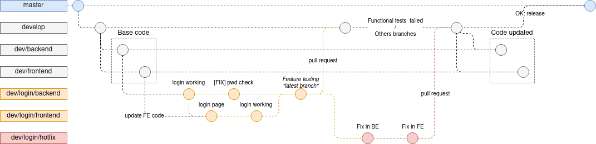

# Git usage (for developer)

This document states our git processes.

## Commit message rules

A commit message should look like this: `(?["STATE"]) (?{"ISSUE_KEY"}) "summary"`

With the following "names":

**summary:** A summary line starts with a keyword and a brief summary of what the change does. Make sure to describe how the behavior now is.

**STATE:** (optional, UPPERCASE) To use when the commit does not have a global meaning of "task"  
The state can take **one** of the following values:
  - `[BUGFIX]`: A fix for a bug
  - `[LOGICFIX]`: A fix for a logic problem
  - `[DOCS]`: When adding of editing documentation  

`[WIP]` Can be added **before** an other state to signal that the work is still in progress  
`[FOLLOWUP]` Can be added **before** to signal that it is in relationto the **previous** commit

**ISSUE_KEY:** The "Jira Key" used to link the issues from Jira.

### Examples

- normal: `{DEV-12330} Init Backend`
- with a state: `[BUGFIX] reload db on error`
- with both: `[LOGICFIX] {DEV-12330} Login really works now`
- work in progress `[WIP][LOGICFIX] {DEV-12330} Login really works now`
- followup `[FOLLOWUP][LOGICFIX] {DEV-12330} Login really works now`

## Branch naming

There are 4 main branches on which we normally do not code directly:

- **dev/backend** & **dev/frontend**: Main branches separating the *backend* and the *frontend*, they are equivalent to a **develop** branch for these two parts.
- **develop**: Usually before merging on **master**: A functional code on which is added a set of new features to be tested for validation.
- **master**: Represents a stable production state: All the code works and provides a functional solution.

New branches should look like: `dev/<feeature>/<name>`.  

Where  
- *\<feature\>* is a meaningful name of the feature/task to develop AND/OR related to a Jira Issue.
- *\<name\>* could be described as a subtask of the feature.

examples: `dev/login/backend` or `dev/{P2-23}-login/frontend` with a "Jira Key"

For other changes not directly related to code like user documentation this **must** be done on a **documentation** branch and then merged on **develop** or **master** via a pull request that **must** be validated by quality control.

### In case of failure in verifications

If the CI fails on a pull request, the merge is not done and the fix has to be done on the unmerged branch.  
If the merge has already been done and a bug is found a `<name>/hotfix` branch is created to fix the issue and a pull request is done on the original branch. Then the fix is also merged on the lower branch to apply the fix.

Where *\<name\>* is a meaningful name of the hotfix to implement AND related to a Jira Issue (usually the same name as given for the task).

## Usage example

We need to implement a *login method*:

- `dev/login/backend`: is used on the backend folder and comes from the `dev/backend` that contains the base code.  
  (Note. It can be created from another branch if It makes sens, for example: `dev/user-entity/backend`)
- `dev/login/frontend`: is used for the frontend part and is created from the previous branch `dev/login/backend`.  
  (Another branch can be merged into this one to update the code, for example: `dev/frontend`)
- When the feature is complete on each branch, all its content should be available on the latest branch  <!-- TODO: or with another name? -->
- Once it's done and verified: merge (pull request) the last updated branch into `develop`
- If there's error(s) on the merged `develop` branch (due to the new feature), a `dev/login/hotfix` is created to fix the feature then merged again in `develop`.
- Verifications of the `develop` branch and then merge into `master` for a new release.
- The `develop` branch can be merged into `dev/backend` and `dev/frontend` to update the base code.

### Gitflow diagram

Here's a diagram of the example above:

