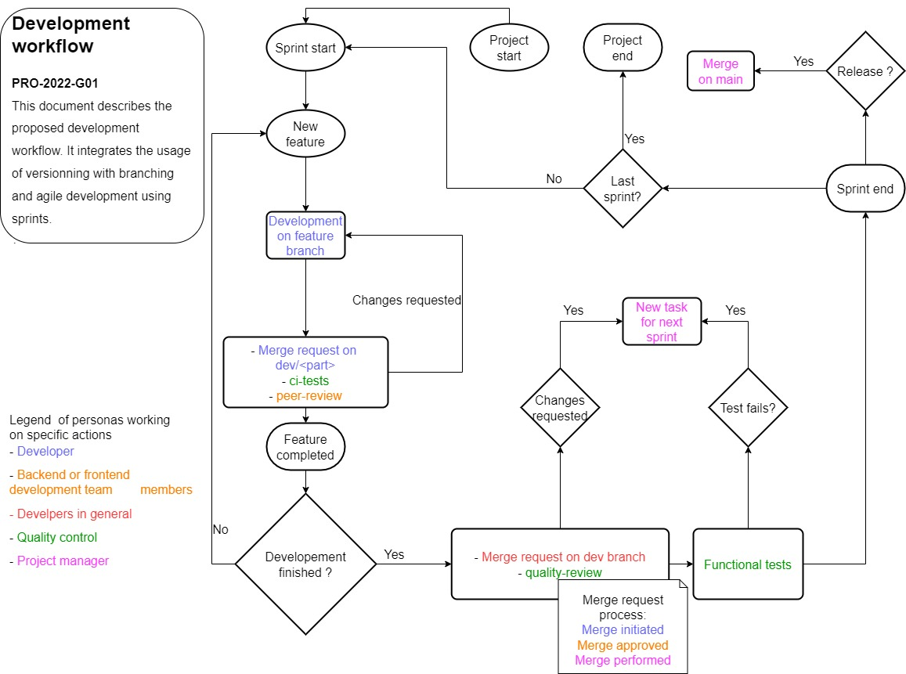

# Quality process

## Git usages

The conventions of message commits and name's branches are defined in the following document: [git.md](git.md)

## Code usage

The backend and frontend teams use linters for their technology stack to ensure that the respective code standards and conventions are respected.

* Backend
  * Linter: cs-fixer
  * Standard: [PSR12](https://www.php-fig.org/psr/psr-12/)
* Frontend:
  * Linter: [ESLint](https://eslint.org/)
  * Standard: Custom, defined in file `app/frontend/.eslintrc.json`

## Worflow

The workflow will follow the "rules" describes in the following diagram:

At the end of a sprint, the quality manager and the project manager will make manual functional tests and every bug detected will be reported in Jira for the next sprint. Those functional tests will follow a guideline where all tests manipulations are described with the expected behavior. The tests results will then be recorded and kept on the MR. 

## Merge request

### Review

Code reviews are made using peer-review methodology. Their exchanges are made on the merge request itself. The merge request won't be merged until agreement and all conversations resolutions. In the case where their opinions cannot converge an external mediator will decide which solution is best.

### Changelog

When creating a merge request, the changes must be specified in the [changelog.md](changelog.md) file.

The developer must add a line at the beginning of the file containing the date and the description of the change. 
For example, if a bugfix on the login is fixed the 23 april, the developer will write the following line in the changelog.md file: 

`23 April [BUGFIX] Fix login`

### Tests

Tests are automatically run using the github-workflow CI and their success is mandatory to enable the MR validation.

* Backend Framework: [phpunit](https://phpunit.de/)
* Frontend Framework: [Jasmin](https://jasmine.github.io/)

### Code coverage

A minimum of code coverage as been set to ensure that enough part of the code are tested. However the backend and the frontend will have different threshold since there will be a lot of logic-less code for design which is insignificant. 

* Backend: 80%
* Frontend: 30% 

The code coverage must be satisfied to enable the MR validation.
