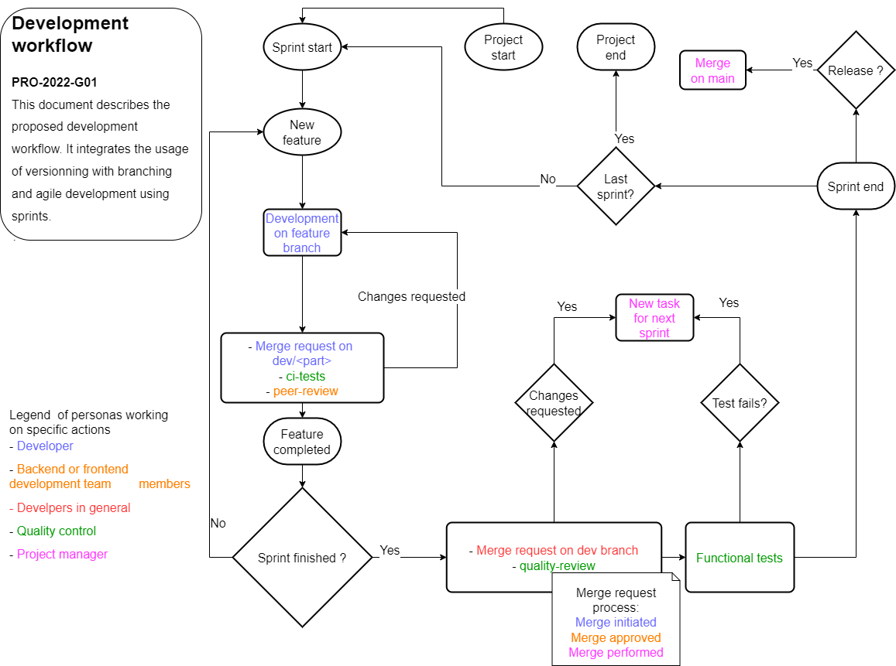

# Quality process

## Git usages

The conventions of message commits and name's branches are difined in the following document: [git.md](git.md)

## Worflow

The workflow will follow the "rules" describes in the following diagram:

## Merge request

### Code coverage

***TODO: define the coverage code and the percentage accepted for a MR with dev***

### Review

Developpers must make peer-review by adding the other developper of the project (backend or frontend) as Reviewer of the merge request. 
The reviewer will add comments at the merge request if something seems wrong to him.
He can also adds some TODO in the code and commit with a message "Code review".

### Changelog

When creating a merge request, the changes must be spcecified in the [changelog.md](changelog.md) file.

In the file, the developper must add a lign at the begening of the file. The line must contain the date and the commit message of the last changes.

The file contains an example of a chage.

### Uint tests

Before creating a merge request, the developper must be sure that all unit tests pass.