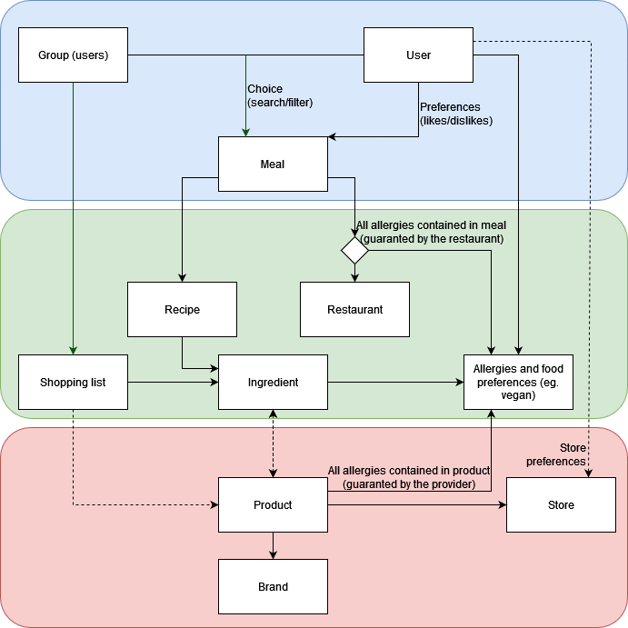

# PRO-2022 Cahier des charges
V3.0 - 18.03.2022
## Project introduction & context
Have you ever found yourself endlessly Googling for meals ideas ? Or trying to choose what to cook for your next meal with your laser-game squad? Or been in a city you don't know, trying to find a restaurant that would match your tedious food preferences?

This is where our project positions itself. 

Centered around a user's preferences: allergies and intolerences, meal type and origin, preparation time wished, we will solve the daily challenges that one may face when it comes to eating.

### A few words about allergies
Since a few of our team members have allergies, we know that it's a complicated subject to manage and there is no correct way of doing it. For that, we will use a "pessimist" approach:
* Each meal can be made of either ingredients or food preparations
* A food preparation can be made of ingredients
* Food preparations and meals can be marked as unsuitable for a given allery
* A meal using a specific food preparation will inherit its allergy warnings

## Objectives
The market for food&eating realted websites is already well taken by major actors in our initial geographical permiter (French-speaking part of Switzerland): Marmiton, Betty Bossy, a simple Google search. If we want to be competitive, we have two choices
* Take on a specific competitor and be better than them
* Create a set of features that allows the user to do a bit of each competitor in our product.

We are aiming at the second option. We want to replace endless Google searches for a meal idea, endless Whatsapp discussions on what to eat at the family gathering. 
With a recipe engine based on one or multiple user's "food profile", a meal idea can be found easily, directly linked to a recipe on our platform.

## Detailed uses cases
### 1. Allergy concerns in meal choices (required)
#### Context
A young adult, about 30, invites some friends to eat on a Friday night. She wants to cook a nice meal, with a starter, a main course, and a desert. The budget is not a problem, but some of the guests have allergies.

#### Solution
She creates a group in the application and adds all of her guests. The application then suggests some recipes taking into account the allergies of her guests.

### 2. Voting on a group meals (required)
#### Context
A group of friends is planning to cook together. They each have individual preferences and can't reach an understanding over what to cook.

#### Solution
They all join a group and the application suggests a list of possible meals. They can vote on their preferred choice. Once everyone voted, the application shows the results.

### 3. Recipes containing specific ingredients (required)
#### Context
A student is about to meet the parents of her boyfriend for the first time. She wants to impress them with a nice homemade meal. She wants red meet to be the center piece of the main course.

#### Solution
She inputs her criteria and the application suggests recipes with rib eye steaks or beef tenderloin.

### 4. Recipe cooked in a specified amount of time (required)
#### Context
A student doesn't have much time to prepare a lunch. He knows that he has leeks in his fridge that he needs to eat soon. Moreover, he needs a meal that requires about 20 minutes of preparation.

#### Solution
The application will therefore suggest a list of recipes containing leeks and cooked quickly.

### 5. Restaurant suggestion (wished)
#### Context
An employee is in charge of choosing the restaurant for the end-of-the-year office party. He doesn't know the individual preferences of all of his coworkers, but they are all signed up on the platform.

#### Solution
He inputs who will partake and the approximate location where the restaurant should be. The application then suggests a list of restaurants best matching the preferences of his coworkers.

### 6. Shopping list (wished)
#### Context
A recipe has been chosen for a meal between friends. The host must now go and buy all the ingredients ahead of the meal.

#### Solution
The application automatically generates a shopping list based on the recipe and the number of guests.

## Specification
This document states the features that will be supported on each iteration.

### Global vision
This diagram show global vision of the features that would be supported by the application.

#### Blocks
##### Main Blocks
* Blue: The users can choose a meal for themselves or for a group. This is barely the core of the service  and needs to be extended by other blocks.
* Green: Meals can be cocked using many recipes and ingredients, and this is part of the biggest issue when choosing a meal. 
* Red: There are many providers for each ingredients. Ingredients have different characteristics (size, price, taste, ...) and are sold in different places. This blocks aims to have more precise informations about the recipe and also to geolocalise stores that sell the ingredients.

##### Secondary Blocks
* Yellow: Features that helps planning meals
* Purple: Not only would you choose what you eat, but also where.

#### Project Focus
By importance, the most important features are the blue and green blocks:  
* They will allow a community to grow really fast.
* The service will be ready for production
  * We will be able to obtain data to prioritize the next revenue streams.
  * We will gain attention from brand in order to implement the red block.

The project will focus on the blue and green blocks.  Even if they are not directly the biggest revenue stream of the service, having them first will cost less and be ready in fewer time. We will be then able to have a better response to the market and maximize the benefits of the application with the red block once the service as gained popularity.

### Revenue stream
Active advertising have a negative impact on user experience which is bad for us as we want to create a community. Especially considering that the application will mainly be used on phones.  
This kind of service works better with:
* Premium tier adding extra features
* Production promotion: Companies can pay to have their products highlighted.

The product promotion will be dealt with in the future in the red block. We need to gain popularity first.  
Considering that the benefits are proportional to the number of users, we need to gain popularity quickly to generate bigger revenues. If we prioritize premium features, we could generate our first incomes quicker, but the community would grow smaller as there would be fewer free features.  
The choice is made to prioritize importants freemium features. This is an investment in order to maximize the future benefits.

### Iterations
**Project start date**: 9.3.2022
**Project end date**: 3.6.2022
**Total**: 12 weeks

* The project will be delivered at 3 stages of its development. The most important features are all integrated in the first two steps, but the importance alone won't define the priority. They were selected then planned in order to optimize the delivery process.
* If needed, features can be shifted to the next iteration. The third iteration is kept for this usage, otherwise it will be used to add extra features.
* An intermediate presentation will take place on the first iteration's end. 

#### 1. First working version (5Weeks -> Date:  13/4/2022)
##### User features
* User can sign up and sign in into the application using login/password
* User can sign up and sign in into the application using OAuth
* User can update their profiles
  * Add/remove their allergies/ethics (e.g. Vegan)
  * Add/remove preferences (likes and dislikes)
* Users can find a meal and a receipt based on their profiles and the following filters
  * Recipe contains specific ingredients
  * Recipe cooking-time under a specified value.
  * Type of meal (Asiatic, Italian, Mexican, ...)
* Users can shuffle the search result
* User can add its own receipts (available for anyone)
* User can mark receipts.

##### Additional features
* Definition of the entity model
* Research of source of data
* There is an easy way to import large amount of data
* Samples of real data will already be available
* There is a way to differentiate premium users from freemium ones

#### 2. Groups Management (5Weeks -> Date:  18/5/2022)
##### User features
* User can add/remove other user as their friends.
* User can create and delete groups
* User can add/remove other users (even not their friends)
* User can select the meal and receipt for the group
* User can choose some meals and let the group vote

##### Additional features
* Data will be added in a larger scale.

#### 3. Project consolidation and paid features(2Weeks -> Date:  1/6/2022)
This iteration is used to consolidate the previous ones. If we have enough time, we will add some premium features from the backlog.

##### Example of User features (paid features) if enough time
* User can plan meals for a period and generate a shopping list
* Agenda (google) integration: user can bind a meal date with its calendar

##### Additional features
* Consolidation of existing features
* This iteration is also a buffer for previous iterations

### Disclaimers
- This application will not provide integrated chats or forums, it does not aim to be a communication mean.
- This application won't allow to post
- This application is not a delivery service itself as UberEat or Smood. But it may integrate with those kind of service in future extensions.
- All the paid features won't be integrated right away. Most of them will be added after the production release along with the community's growth.
- The application won't handle multiple languages. 

## Technical Specification
### Stack
“[LAMP](https://doc.ubuntu-fr.org/lamp)” Web application, divided into backend/frontend:

- ​	Apache2-Php with  [Symfony](https://symfony.com/) framework for the backend.
- ​	Javascript with [Angular](https://angular.io/) for the frontend
- ​	MariaDB as DBMS
- ​	OS Linux

#### Remarks
- The choices were made according to the skills and wish of the team's members as long as the technology suited the project well. This ensure that the technologies are mastered and reduce the risks.
- MariaDB was choosen over Postgresql because it is well integrated with php and it is easier to find [DBaaS](https://blogs.oracle.com/oracle-france/post/definition-database-as-a-service) providers for MariaDB.

### Resources needs
* There is no strong need for resources, even on connection peak during meal time
  * There will not be any feature that requires a lot of resources
  * There will not be any feature that will be solicited a lot on a small period of time (i.e. thousands of requests each secondes)
* The application is monolithic and will be launched on a single platform. Therefore:
  * it does not need to be cross-platform.
  * Docker is not a real advantage: Docker is very good to handle micro-services architectures
* The application's success lay on its popularity. The UX needs to be really well made to please the user and the overall project needs to be maintainable in order to be extended.

### Deployment (Production and Dev)
Since our application is a monolith, docker is not a good choice.  
* Docker is very good when it comes to micro-services architectures and broad-scaling, but stateful applications becomes harder to deal with. Docker support for storage is not as developed as the rest. There are plugins but most of docker's container plugins are not maintained anymore.
* Docker is also good to isolate services from others, but we don't plan to deploy other services than this one. 
* We would need an environment where we would install docker when we could have used this environment to deploy the application directly.
* Self managed docker are pretty expensive for the needs we have.  

In opposition,
* Most cloud providers provide snapshots solutions
* The application is very simple to deploy with a bootstrap script.  

Also, we already have an hosting solution available and the choice was made according to possibilities we had.  
We choose to use vagrant for developpement. It provides a way to develop quickly on any plateform in a similar way that the service will be deployed in production  
